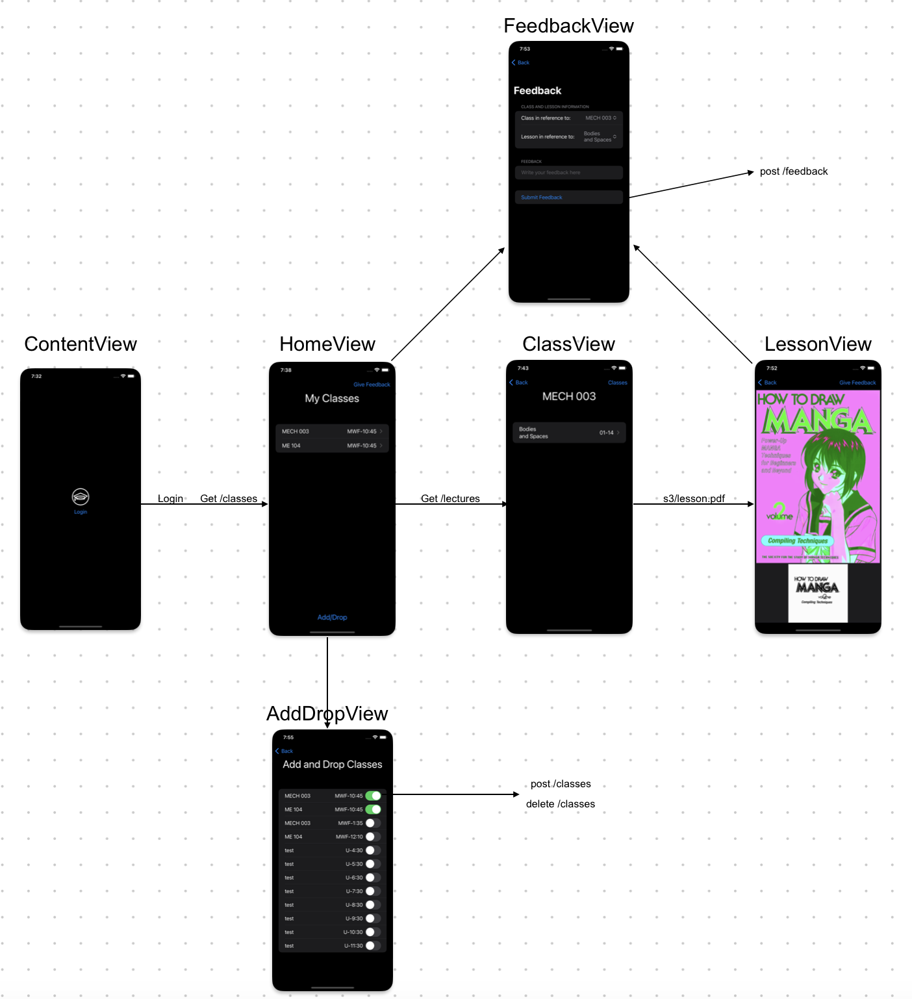
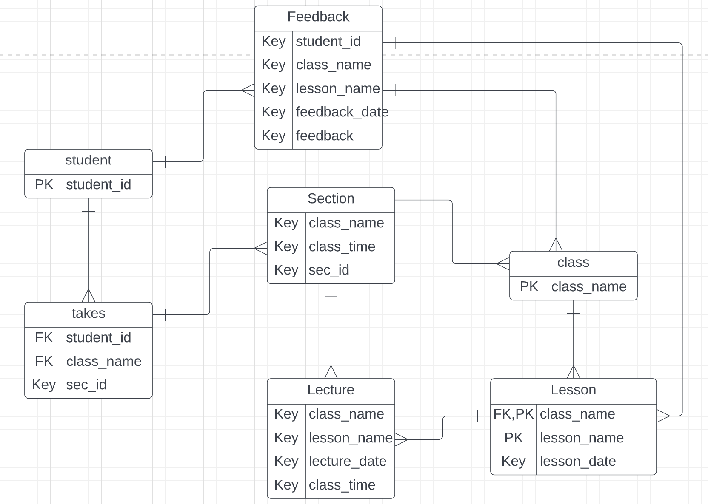

# IsaGo

## App Flow

## Database

## Backend
### Build Instructions
1. Open the project folder either locally or in an Ubuntu Lightsail Server with a static IP
    - Make sure you have docker, docker compose
2. `sudo docker compose build` OR `sudo docker-compose build`
3. `sudo docker compose up` OR `sudo docker-compose up`
    - add `-d` to run as a background process

### Connecting to database with psql 
1. `sudo docker ps` to get the id of the postgres container
2. `sudo docker exec -it ${id} bash`
3. `psql -h localhost -U postgres`
4. Make queries
    - `\d` to see all tables

### Routes
[Routes, their purpose, and the format of any objects](https://docs.google.com/document/d/1zhcsLLwRJtMy2aso6i62sg_SLirOc6hXPOghpbA3L0U/edit?usp=sharing)

## Testing
[Testing Document](https://docs.google.com/document/d/1DiE2fn9C1UhI_aS4ZtyHsLVq7jMHtkIYRhclK2Z-oKQ/edit?usp=sharing) 

